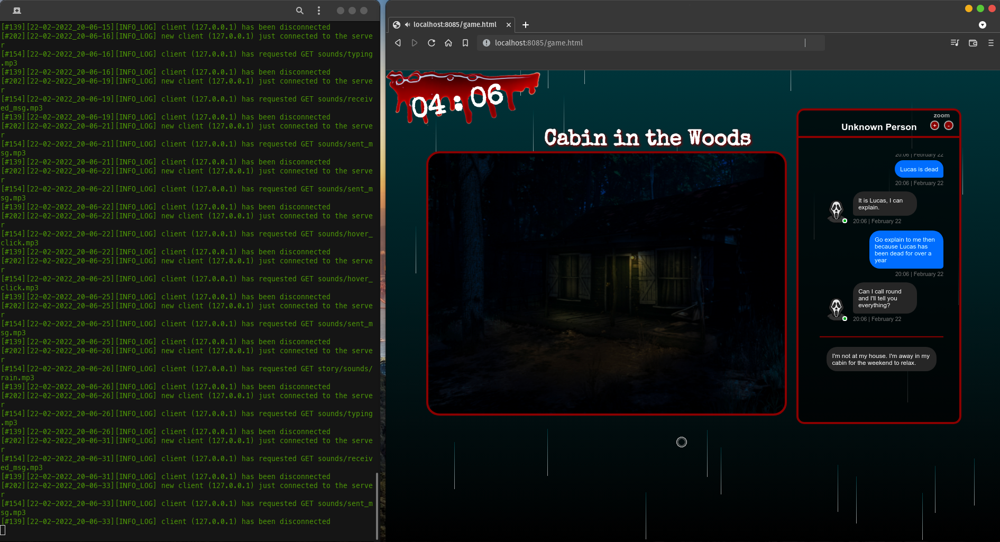
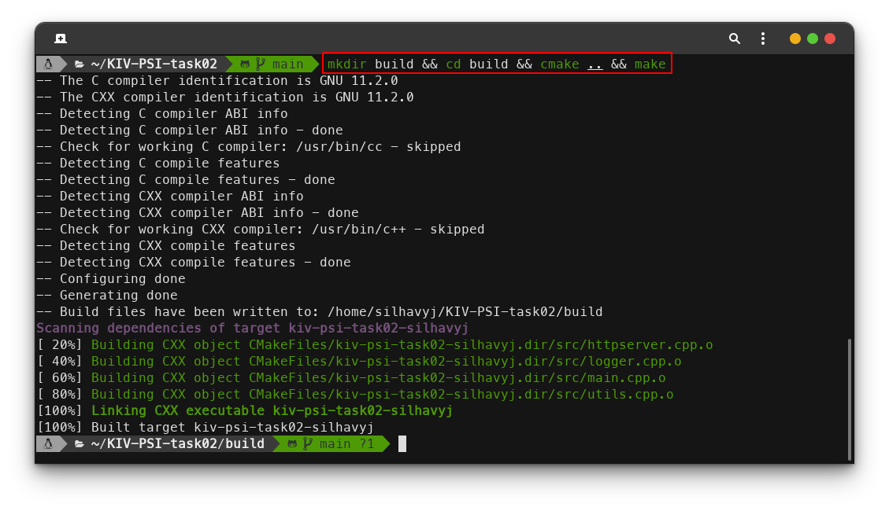
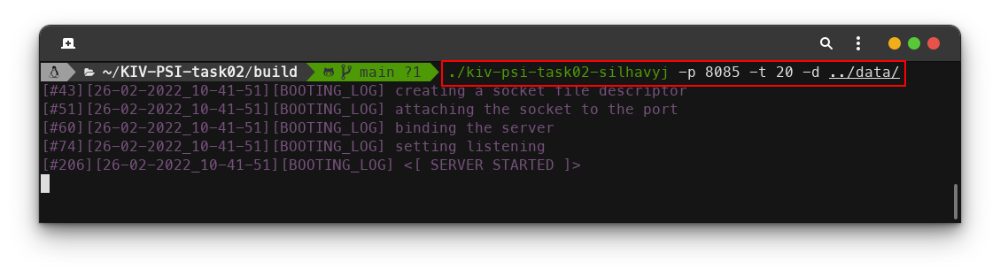
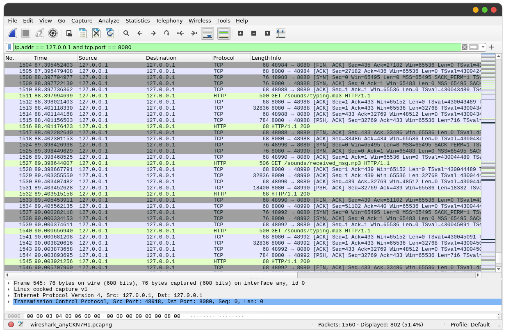

# KIV/PSI task 02 - Multi-threaded HTTP server

- [Build](#build)
    * [Requirements](#requirements)
    * [Compilation](#compilation)
    * [External libraries](#external-libraries)
- [Execution](#execution)
    * [Examples](#examples)
    * [Running in Docker](#running-in-docker)
- [Logging](#logging)
- [Testing](#testing)
    * [WireShark capture](#wireshark-capture)
- [Implementation details](#implementation-details)
    * [Thread pool](#thread-pool)
    * [Client connection timeout](#client-connection-timeout)
    * [Isolating exposed files](#isolating-exposed-files)

This project is for academic purposes only and may potentially contain security vulnerabilities. Therefore, use it at your own risk. However, some precautions where taken during the process of implementation - see the implementation details. 



## Build

### Requirements

In order to successfully compile the application, you're required to have `cmake` installed on your machine. Additionally, this application runs on **Linux only**. To install `cmake` on a debian-based distribution, you can simply run the following command.

```bash
sudo apt-get install cmake
```

### Compilation

Once you have installed `cmake` on your machine, clone this project and navigate into the root folder of the project structure. Here, you're required to run the following sequence of commands.

```bash
mkdir build && cd build && cmake .. && make
```

Upon successful execution, a file called `kiv-psi-task02-silhavyj` should be created. This file represents the executable binary of the application.



### External libraries

As for external libraries used in the project, I took advantage of the `cxxopts` library which parses arguments from the command line https://github.com/jarro2783/cxxopts. 

## Execution

The application does not require any parameters to be passed in from the terminal. However, the user change a few things in order to adjust the behavior of the application. As a first step, run the application like so:

```bash
./kiv-psi-task02-silhavyj --help
```

You will be prompted with a help menu that tells you all the options the server can be run with.

```
Multi-threaded HTTP server
Usage:
  ./kiv-psi-task02-silhavyj [OPTION...]

  -i, --ip arg         IP address the server will be bound to (default: 
                       127.0.0.1)
  -p, --port arg       Port the server will run on (default: 8080)
  -t, --threads arg    Size of the thread pool (default: 10)
  -d, --directory arg  Working directory (default: ./)
  -h, --help           prints help
```

If you're planning to test the application on your local machine only, you don't have to make any changes to the IP address. However, you may want to change the default port if you happen to have another service running on the same port. You can increase the performance of the server by increasing the amount of workers - the size of the thread pool. The working directory option identifies the root directory that will be accessible through the server interface - GET requests.

### Examples

```bash
./kiv-psi-task02-silhavyj -p 8085 -t 20 -d ../data/
./kiv-psi-task02-silhavyj --port 8085 --directory ../data/
```



You can verify the server is up and running by executing the following command.

```bash
netstat -tupln | grep 8085 
```

### Running in Docker

Alternatively, if you do not want to install `cmake` on your machine or you do not happen to have a Linux machine, you can run the application in a docker container. Navigate into the root folder of the project structure and execute the following command.

```
docker build -t kiv-psi-task02-silhavyj .
```

This creates a docker image of the application. Secondly, run the following command to start a docker container. Please do make sure that you expose the port on which you're planning to run the application, so it can be accessed from your local machine.

```
docker run -d -p 8080:8080 --name http-server kiv-psi-task02-silhavyj
```

And finally, in order to get into the running container, execute the following command.

```
docker exec -it http-server sh -c "cd /app && /bin/bash"
```

This will bring you into `/app` where this application is located. From this point you can run the server as described previously. 

## Logging

Once the program has started, you can notice logs being printed out to the terminal. These logs are meant to capture what the server's currently doing. They are also being stored into a file for possible further analysis. All log files are stored into the `log` folder which can be found in the same directory the server was started from.

## Testing

In order to test the functionality of the application, I have included a simple website that was created as a team project when I was on Erasmus in Belfast. The website is supposed to be an interactive horror game, and while it may not be the most efficient application as far as resources are concerned, it does send a fair amount of request to the server. It needs to pull down files such as images, sound effects, CSS, HTML, and JS. Therefore, I figured it could be a good application to be run off of this server.

Feel free to create your own testing folder with a couple of test files of your own :)

I also used the `netcat` tool to test the server. Some scenarios I carried out include the following.

- Starting up the server with the default setup (localhost; port 8080)
```bash
./kiv-psi-task02-silhavyj
```

- Trying to hammer down the server like so

```bash
cat /dev/random | nc 127.0.0.1 8080
```

The server will log the following message: `[#160][22-02-2022_20-19-11][WARNING_LOG] client (127.0.0.1) sent an invalid GET REQUEST`

- Trying to be a little sneaky 

```bash
echo 'GET /../../../../../../../../../../etc/passwd HTTP/1.1' | nc 127.0.0.1 8080
```

The server will log the following message: `[#157][22-02-2022_20-22-41][WARNING_LOG] client (127.0.0.1) has requested a malicious path ../../../../../../../../../../etc/passwd`

- Trying to print out the contents of a file located in the working directory

```bash
echo 'GET Makefile HTTP/1.1' | nc 127.0.0.1 8080
```

The request goes through since it's a valid GET request for an existing file.

### WireShark capture



## Implementation details

### Thread pool

Upon the start of the server, there is a pre-defined amount of worker threads created. The purpose of these threads is to handle connections from the clients and response to their requests. When a client connects to the server, their connection is stored into a queue waiting to be processed by one of the workers. If there is no request (connection) to be processed, all workers are temporarily blocked off on a condition variable (reducing CPU usage). When a new connection is accepted, one of the workers is woken up, so it can handle the client.
Having a fixed number of threads help prevent a possible DOS attack (with each connection a new thread would be created).

### Client connection timeout

Another security measure I implemented is a helper thread that keeps checking if the client sent their request within a reasonable time. If they open up a new connection and don't send anything in 5s, the connection will be simply dropped as it's considered as suspicious behavior. This way, the workers won't be occupied for an undefined amount of time.

### Isolating exposed files

Lastly, I decided to forbid any paths that involve `..` or `.`. This approach is meant to prevent exposing sensitive files, such as the `/etc/passwd` file. Therefore, the client has access only to the directory which is specified on startup by using the `-d` option.